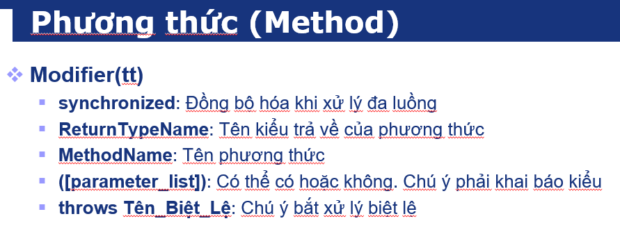

# Class in Java
Trong java :
- Ở trong "public static void main" có thể gọi tới class bao phủ

_Đoạn code sẽ in ra "Nhật"_

- Tương tự ở trong "public static void main" có thể tạo 1 lớp khác

- Một số thuộc tin của class trong java

# Tính kế thừa trong java

- ví dụ cụ thể
-  
- Lớp cha là lớp person , lớp con là lơp Nhat
- Nếu khai báo lớp con mà không có thuộc tính của lớp cha thì thuộc tính mặc định là null
- Trường hợp method ở lớp con ghi đè lên thuộc tính ở lớp chả thì chạy hàm ở lớp con
- Còn không ghi đè thì chạy hàm ở lớp cha
- Lớp cha được tạo trước xong lớp con tạo , nếu trong construction cuả cả lớp cha và con đề có System.out.print(" ") thì in lớp cha trước, lớp con sau
# Biến trong class

- biến static chỉ dùng cho hàm static
- biến final chỉ khai báo được lần đầu tiên
- biến transient được dùng để không lưu trữ dữ liệu khi đối tượng của lớp đó được huyển đổi thành một chuỗi byte để lưu trữ hoặc truyền đi
- Ví dụ:

- 
Trong ví dụ trên:
    - transientVar sẽ không được lưu trữ khi đối tượng của MyClass được serialized, trong khi normalVar sẽ được serialized bình thường.
- biến volatile đảm bảo khả năng đồng bộ giá trị biến trên các luồng
Ví dụ : 
- 
Biến count được khai báo là volatile 

- Lớp IncrementThread có 1 đối tượng là Counter

- Lớp PrintThread cũng có 1 đối tượng là Counter

- Đoạn code lớp AMain in ra
+ Vậy khi khai báo biến volatile thì khi giá trị ở 1 thread thay đổi chũng làm thay đổi giá trị ở thread khác
- Access specifiers : public , protected, private,default
# Phương thức trong java

Khác với volatile đồng bộ biến trong môi trường đa luồng thì synchrnized đồng bộ method trong môi trường đa luồng
 - ví dụ :

 - 
Trong ví dụ trên lớp Ecounter có hai phương thức synchrnized là increment và getCount và ở lớp emain tạo ra 2 luồng : 1 luồng tăng v 1 luồng in ra 
khi tăng ở luồng 1 thì giá trị in ra ở luồng 2 được đồng bộ
# Method Overloading
- là các method có cùng 1 lớp , cùng tên , nhưng khác tham số truyền vào , overloading cũng là 1 hình thức đa hình trong java , 
- Hàm có ở lớp cha được overloading lại ở lớp con

# Toán tử bit trong java

- >> ~ : phủ định , đảo bit
  > 
    - ví dụ : a = 42 -> a = 00101010 khi đảo bit a thì thành 11010101 là -43
- >> & : and  ( có thể xem là nhân )
  > 
    - ví dụ : a = 5 (00000101) và b = 3 (00000011) thì a & b  = 00000001 = 1
- >> | : or ( có thể xem là cộng )
  > 
    - ví dụ : a = 5 (00000101) và b = 3 (00000011) thì a | b  = 00000111 = 7
- >> ^ : xor : nếu 2 giá trị giống nhau là false , còn khác nhau là true
  > 
    - ví dụ : a = 5 (00000101) và b = 3 (00000011) thì a ^ b  = 00000110 =6
- >> '>>' : dịch phải ( có thể hiểu là thêm 2 bit 0 bên trái)
    - ví dụ : a = 10 (00001010) thì a >> 2 = 00000010 = 2
- >> '<<' : dịch trái ( có thể hiểu là thêm 2 bit 0 bên phải)
    - ví dụ : a = 10 ( 00001010 ) thì a << 2 = 00101000 = 40
- >> '>>>' : được sử dụng để thực hiện phép toán dịch bit sang phải không dấu (unsigned shift right) trên các số nguyên.
    - ví dụ : số nguyên a có giá trị là -10 (biểu diễn nhị phân là 11111111 11111111 11111111 11110110). Khi thực hiện phép toán a >>> 2, tất cả các bit của a sẽ được dịch sang phải 2 vị trí, và các bit trống bên trái sẽ được điền vào bằng 0. Kết quả là 1073741821 (biểu diễn nhị phân là 00111111 11111111 11111111 11111101).
### Thứ tự ưu tiên trong toán tử

- ví dụ :

### Khai báo mảng

- ví dụ :

