# String trong java
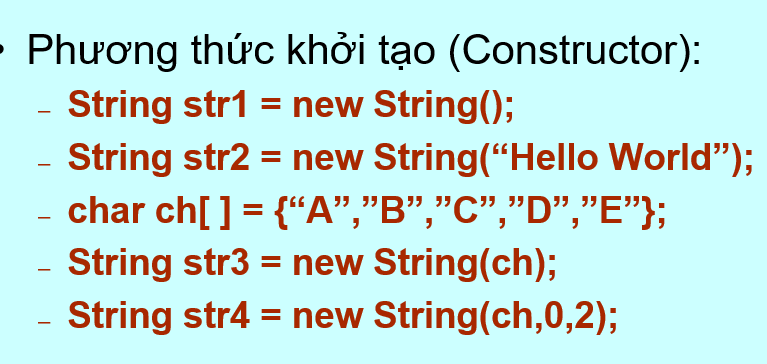
- ví dụ :
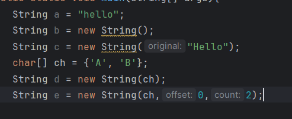
- Lưu ý char ch[] = {"a","b"} sẽ bị lỗi mà phải dùng char[] ch = {'A', 'B'};
- >> Những phương thức trong lớp string
  > - charAt(int index) : lấy ra giá trị tại vị trí index
  > - startsWith(String prefix) : kiểm tra xem chuỗi có bắt đầu bằng prefix
  > - endsWith(String end) :kiểm tra xem chuỗi có kết thúc bằng end
  > - String.copyValueOf(char[] ch) : chuyển char[] thành chuỗi : String.copyValueOf(ch[])
  > - toCharArray() : chuyển chuỗi thàng char[]
  > - indexOf(char ch) : lấy ra vị trí của ch
  > - toUpperCase() : viết hoa tất cả
  > - toLowerCase() : viết thường tất cả
  > - trim() : bỏ khoảng trắng đầu cuối
  > - euquals() : so sánh 2 chuỗi
## Stringbuffer trong java
- >> append(String a) : nối chuỗi a vào chuỗi gốc
  > - ví dụ : 
  > 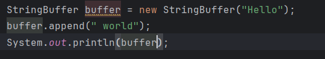 
  > - Kết quả trả về Hello world
- >> insert(int index,String a) : thêm chuỗi a vào vị trí index
  > - ví dụ :
  > 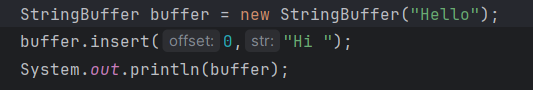
  > - Kết quả trả về Hi Hello
- >> charAt(int index) : trả về kí tự ở vị trí index
- >> setCharAt(int index, char a): thay đổi kí tự tại vị trí index thành a
  > - ví dụ : 
  > 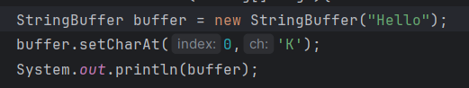
  > - Lưu ý : là '' chứ không phải ""
- >> setLenght(index value): thay đổi giá trị độ dài chuỗi
  > - ví dụ :
  > 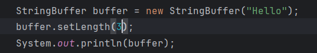
  > - Kết quả trả về Hel
- >> getChars(int srcBegin,int srcEnd,char[] ch,chBegin): sao chép chuỗi gốc từ srcBegin -> srcEnd lưu vào char[] ch từ vị trí chBegin
  > - ví dụ :
  > 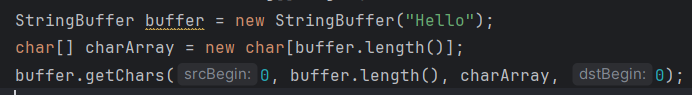
- >> reverse() : đảo chuỗi

# Math trong java
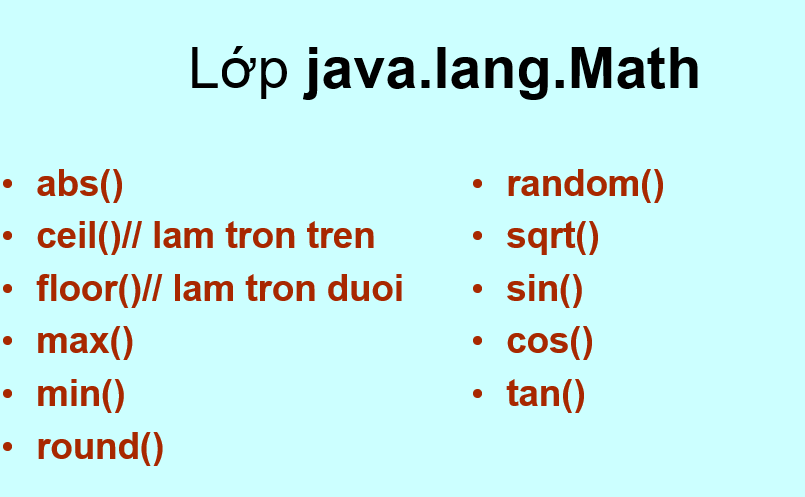
- >> round() nếu > .5 thì làm tròn lên ngược lại thì làm tròn xuống
# Runtime trong java
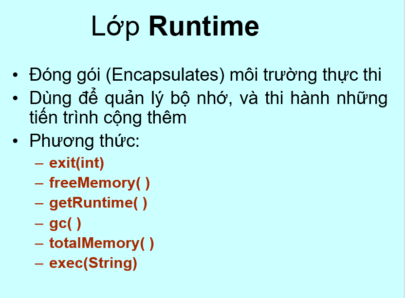
- >> System.exit(int status) : ngắt chương trình đột ngột và trả về status
  > - ví dụ :
  > 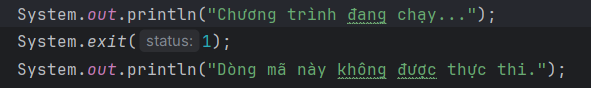
  > - Kết quả in ra : Chương trình đang chạy...
- >> freeMemory() : lấy ra số lượng bộ nhớ trống đơn vị là bytes
  > - ví dụ :
  > 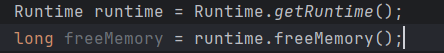
  > - getRuntime() : lấy 1 đối tượng Runtime
- >> totalMemory() : lấy ra tổng bộ nhớ đã cấp phát
  > - ví dụ :
  > 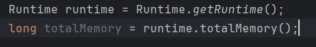
- >> System.gc() : thu gom rác
- >> exec(String command) : thực thi lệnh terminal
  > - ví dụ : Process process = Runtime.getRuntime().exec("ls -l");
  > - Thực thi lệnh "ls -l" để liệt kê các tập tin trong thư mục hiện tại (Unix/Linux)
  > - Lưu ý : exec() đã bị đánh dấu lỗi thời

# Lớp System trong java
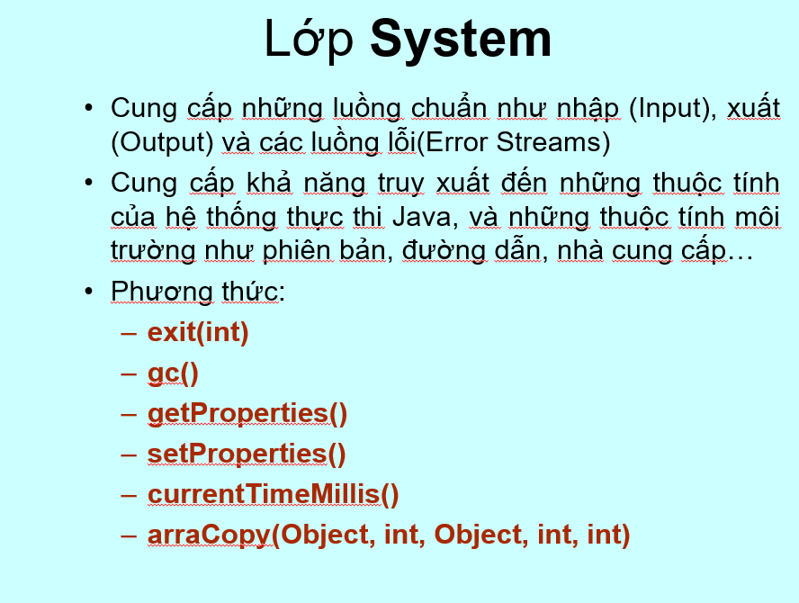
- >> System.getPropertiess() ; System.setProperties() : lấy ra và thay đổi giá trị của các thuộc tính trong hệ thống
- >> currentTimeMillis() : lấy thời gian hiện tại dưới dạng mili giây
- >> arraCopy(srcObject,int srcBegin,targetObj, int targetBegin,int targetEnd): copy mảng này qua mảng khác
  > - ví dụ :
  > 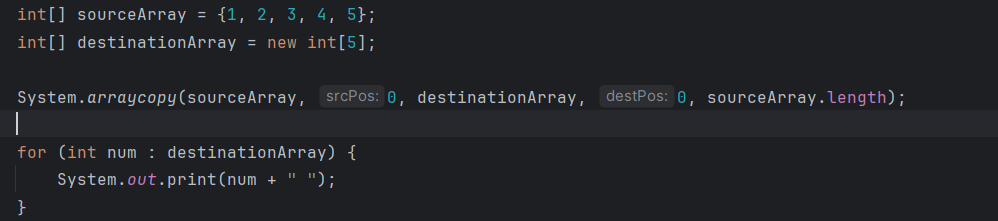

# Lớp object trong java
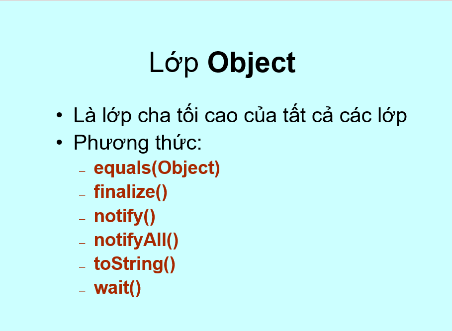

